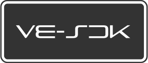

 

 
 

---

<h3>O que é a VitaEngine?</h3>

<h4 align="left">
A <b>VitaEngine</b> é uma plataforma open source idealizada para tornar o 
desenvolvimento de jogos e aplicativos para <b>PS Vita</b> mais acessível, 
integrado e amigável, reduzindo parte da complexidade normalmente associada 
ao ecossistema homebrew tradicional.
 
A proposta da VitaEngine é oferecer, no futuro, uma experiência mais direta 
para criação em <b>Lua</b>, apoiada por uma engine nativa em <b>C++</b> 
executada no próprio console, além de uma <b>IDE desktop dedicada</b> ao 
fluxo de desenvolvimento.
 
 
</h4>

---

<h3>O que é o VE-SDK?</h3>

<h4 align="left">
O <b>VE-SDK (VitaEngine SDK)</b> é o repositório técnico de desenvolvimento da 
própria plataforma VitaEngine.
 
 
Ele reúne a base estrutural usada para construir, testar e evoluir a engine, 
incluindo <b>código-fonte</b>, <b>scripts</b>, <b>dependências</b>, <b>ferramentas 
auxiliares</b>, <b>documentação técnica</b> e demais componentes experimentais 
necessários ao desenvolvimento da plataforma.
 
 
Este repositório <b>não representa a distribuição final orientada ao usuário 
comum</b> da VitaEngine. Seu foco atual é servir como ambiente de desenvolvimento 
da própria engine.
 
 
</h4>

---

<h3>Vale a pena mencionar</h3>

<h4 align="left">
A VitaEngine é um <b>projeto open source, independente, sem fins lucrativos e 
desenvolvido em paralelo</b>, principalmente como um esforço autoral de longo prazo.
 
 
Por esse motivo, <b>não existe cronograma fixo, milestones garantidas ou 
previsão pública de conclusão</b>.
 
 
Apesar de ainda estar em estágio inicial como produto voltado ao usuário final, 
este projeto <b>já possui base técnica real em desenvolvimento</b>, incluindo 
arquitetura em evolução, experimentos de tooling, estrutura de projeto e 
implementação progressiva dos componentes que formarão o ecossistema VitaEngine.
 
 
</h4>

---

<h3>Para quem este repositório é destinado?</h3>

<h4 align="left">
O <b>VE-SDK</b> é voltado principalmente para:
 
 
<ul>
  <li><b>Contribuidores</b></li>
  <li><b>Early adopters</b></li>
  <li><b>Curiosos técnicos</b></li>
  <li>Pessoas interessadas em estudar a arquitetura da VitaEngine</li>
  <li>Pessoas que desejam acompanhar ou testar a evolução técnica da plataforma</li>
</ul>
 
Se a sua intenção é apenas <b>usar a VitaEngine para criar projetos de forma 
direta</b>, a proposta futura é que exista uma distribuição separada, mais 
amigável e orientada ao uso final.
 
 
</h4>

---

<h3>O que este repositório contém?</h3>

<h4 align="left">
De forma geral, o VE-SDK pode incluir componentes como:
 
 
<ul>
  <li><b>IDE</b>: código-fonte e recursos da interface desktop da VitaEngine</li>
  <li><b>Engine</b>: núcleo nativo da engine e seus componentes internos</li>
  <li><b>Scripts</b>: automações de setup, build e manutenção</li>
  <li><b>Toolchains</b>: cadeias de ferramentas ThirdParty necessárias ao ecossistema</li>
  <li><b>Docs</b>: documentação técnica e notas de arquitetura</li>
  <li><b>Assets</b>: recursos visuais e arquivos internos usados pelo ecossistema</li>
</ul>
 
A organização exata pode evoluir com o tempo, conforme a arquitetura da 
plataforma amadurece.
 
 
</h4>

---

<h3>Visão resumida da plataforma</h3>

<h4 align="left">
A proposta da VitaEngine envolve, de forma resumida:
 
 
<ul>
  <li>Uma <b>IDE desktop</b> dedicada ao fluxo de desenvolvimento</li>
  <li>Uma <b>engine nativa em C++</b> executada no PS Vita</li>
  <li>Uma <b>API exposta em Lua</b> para criação de aplicativos e jogos</li>
  <li>Um <b>host nativo</b> responsável por executar projetos no console</li>
  <li>Uma camada de comunicação para <b>preview, testes e iteração em hardware real</b></li>
  <li>Empacotamento final em <b>.VPK</b> para distribuição no PS Vita</li>
</ul>
 
Durante o desenvolvimento, a integração com o console pode ser feita por meio do 
<b>VitaEngine Companion</b>, um aplicativo dedicado para PS Vita que atua como 
ponte entre o hardware real e a IDE da VitaEngine, permitindo preview, testes e 
funcionalidades auxiliares de desenvolvimento.
 
 
Em estágios futuros, parte dessa experiência deverá ser apresentada de forma mais 
acessível em uma distribuição orientada ao usuário final da VitaEngine.
 
<h4>
</h4>

---

<h3>VitaEngine Companion</h3>

<h4 align="left">
O <b>VitaEngine Companion</b> é um aplicativo de <b>PS Vita</b> voltado ao fluxo 
de desenvolvimento da plataforma.
 
 
Seu papel é atuar como uma ponte entre a <b>VitaEngine IDE</b> e o hardware real, 
permitindo recursos como:
 
 
<ul>
  <li><b>Preview</b> de aplicativos e jogos em desenvolvimento</li>
  <li><b>Iteração rápida</b> diretamente no console</li>
  <li><b>Integração com o fluxo de testes</b> durante a etapa de desenvolvimento</li>
  <li>Possíveis recursos auxiliares de <b>debug</b> e comunicação em estágios futuros</li>
</ul>
 
Embora faça parte do ecossistema VitaEngine, o Companion <b>não representa a engine 
em si</b>, e sim um componente especializado voltado ao modo de desenvolvimento.
 
 
</h4>

---

<h3>Instalação do VE-SDK</h3>

<h4 align="left" style="font-family:nunito">
Para facilitar testes e contribuição técnica, este repositório disponibiliza um 
instalador automatizado do <b>VE-SDK</b>, voltado à preparação do ambiente de 
desenvolvimento em <b>Windows 11</b>.
 
 
O instalador pode configurar a estrutura necessária para o desenvolvimento da 
plataforma, incluindo dependências, softwares auxiliares, documentação e atalhos 
convenientes para acesso rápido às principais ferramentas.
 
 
</h4>

> **🛠️ O VE-SDK, neste momento, é voltado principalmente para o desenvolvimento 
> da própria VitaEngine, testes antecipados e contribuição técnica — não para 
> uso final em produção.**

> **⚠️ Atenção: executar scripts remotos pode ser altamente inseguro. Execute 
> apenas arquivos de fontes confiáveis e, sempre que possível, verifique a 
> assinatura/hash antes de executá-los.**

> **✅ Assinatura do arquivo Install.zip (SHA-256): 
> 06C5D61AD0554CD7E0FF1E5079A88392427E1863F3DA49C2306CBEA2B148E0B3**

<h4 align="left">
<em>Arquivo de instalação: 
<a href="https://github.com/ali90taz/VitaEngine/raw/staging/Install.zip">Install.zip</a></em>
 
</h4>

<h4>Como instalar:</h4>

<h4 align="left">
1. Baixe o <b>Install.zip</b>
 
2. Extraia o conteúdo
 
3. Execute o <b>Install.lnk</b>
 
4. Confirme os prompts
 
5. Aguarde a configuração automática
 
 
Se preferir uma instalação manual ou quiser entender exatamente o que o 
instalador faz, consulte o arquivo:
 
 
<i>Scripts/<a href="https://github.com/ali90taz/VitaEngine/blob/staging/Scripts/Setup.ps1">Setup.ps1</a></i>
 
</h4>

---

<h3>Um pouco de história e motivação</h3>

<h4 align="left">
Por quê?
 
 
O PS Vita teve uma vida curta, apesar de ser um portátil extremamente promissor.
Infelizmente, sua biblioteca oficial não recebeu tantos títulos quanto poderia.
Felizmente, existe o outro lado da moeda: a comunidade homebrew.
 
 
Todo console tem a sua, e com o PS Vita não foi diferente. Graças ao esforço
magistral de pessoas extremamente talentosas, hoje podemos aproveitar jogos
e aplicativos criados de forma não oficial, expandindo o potencial de um hardware
que merecia muito mais.
 
 
Mas para alguns de nós, apenas aproveitar não é suficiente — queremos também
participar, criar e dar vida a novas ideias.
 
 
O problema é que criar para o PS Vita ainda está longe de ser algo simples. Mesmo
com todo o excelente trabalho já realizado pela comunidade, colocar um aplicativo
funcional para rodar no console ainda pode exigir uma longa jornada de configuração:
ambiente Linux, familiaridade com C, CMake, Makefiles e uma boa compreensão de como
o Vita SDK funciona. No fim, ainda resta torcer para que tudo compile sem erros.
 
 
Para quem está começando, esse processo pode ser intimidador, frustrante e
consumir dias — ou até semanas — até que algo realmente funcione.
 
 
Existem projetos excelentes, como o <a href="https://github.com/Rinnegatamante/lpp-vita">
Lua Player Plus Vita</a>,
que já abstraem boa parte dessa complexidade e merecem enorme respeito por isso.
Ainda assim, eles não oferecem exatamente uma experiência de “abrir e começar”.
São ferramentas poderosas, mas ainda bastante voltadas a usuários mais curiosos
e avançados.
 
 
É justamente nesse espaço que a VitaEngine se propõe a atuar: não para substituir
o trabalho da comunidade, mas para construir uma camada acima dele — mais acessível,
mais integrada e mais amigável — tornando o desenvolvimento para PS Vita mais direto,
mais moderno e mais inspirador.
 
 
</h4>

---

<h3>Perguntas frequentes</h3>

<h4 align="left">

<b>P:</b> Quais plataformas serão suportadas?
 
<b>R:</b> A VitaEngine está sendo desenvolvida inicialmente para <b>Windows moderno</b>.
No futuro, a intenção é expandir o suporte para <b>Linux</b> e <b>macOS</b>.
 
 
<b>P:</b> Quais modelos de PS Vita serão suportados pelos aplicativos gerados?
 
<b>R:</b> A VitaEngine foi idealizada para gerar aplicativos e jogos em 
<b>.VPK</b> compatíveis com os modelos <b>PS Vita Fat</b> e <b>PS Vita Slim</b>. 
No momento, não há previsão de suporte oficial ao <b>PS TV</b>.
 
 
<b>P:</b> A VitaEngine será uma engine completa ou apenas uma camada sobre o Vita SDK?
 
<b>R:</b> A proposta da VitaEngine é ir além de uma simples camada sobre o Vita SDK.
O objetivo é se tornar uma plataforma de desenvolvimento com fluxo próprio,
API de alto nível e experiência integrada, inspirada em engines modernas como
<b>Unreal Engine</b>, <b>Unity</b> e <b>GameMaker</b>, mas pensada exclusivamente 
para o <b>PS Vita</b>.
 
 
<b>P:</b> Este repositório já é a forma final recomendada para usar a VitaEngine?
 
<b>R:</b> Não. Este repositório representa o <b>VE-SDK</b>, ou seja, a base 
técnica e o ambiente de desenvolvimento da própria plataforma. A proposta futura 
é que exista uma
distribuição mais amigável e orientada ao usuário final da VitaEngine.
 
 
</h4>

---

<h3>Glossário</h3>

<h4 align="left">

<b>VitaEngine Companion</b> : <i>Aplicativo de PS Vita voltado ao fluxo de 
desenvolvimento da VitaEngine, usado como ponte entre a IDE e o hardware real 
para preview, testes e funcionalidades auxiliares.</i>
 

<b>VE</b> : <i>Alias semântico para VitaEngine, usado como forma abreviada em 
contextos técnicos e organizacionais.</i>
 

<b>VE-SDK</b> : <i>VitaEngine SDK. Base técnica e ambiente de desenvolvimento da 
própria plataforma VitaEngine, voltado a contribuidores, testes e evolução da 
engine.</i>
 

<b>VEA</b> : <i>VitaEngine Application. Prefixo interno utilizado pelos aplicativos 
criados pela VitaEngine.</i>
 

<b>VEP</b> : <i>VitaEngine Project. Extensão de projeto utilizada durante a etapa 
de desenvolvimento.</i>
 
 
</h4>

---

<h3>Créditos</h3>

<h4>
Este projeto utiliza diversos recursos de terceiros, para saber
mais verifique o arquivo 
<a ref="https://github.com/ali90taz/ve-sdk/blob/staging/CREDITS.md"><i>
CREDITS.md</i></a> deste repositório.
 
 
</h4>

---

<h3>Isenção de Responsabilidade</h3>

<h4 align="left">
<ul>
<li>VitaEngine <b>não é afiliado, endorsado, ou licenciado por Sony
Interactive Entertainment</b>.</li>
<li><b>PS Vita</b> é uma marca registrada de Sony Interactive Entertainment.</li>
<li>Nomes de terceiros, recursos e tecnologias pertencem aos seus respectivos
proprietários.</li>
</ul>
 
</h4>

---

<h4 align="left">
 
*Obs: Para experiência superior de visualização, abra este documento no VS Code com o markdown preview.
 
 
</h4>

___

